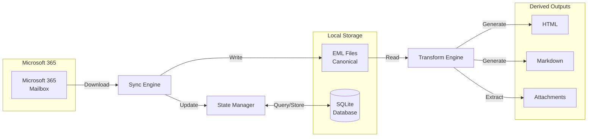

# m365-mail-mirror Technical Design

This document describes the technical architecture and implementation details of m365-mail-mirror.

## Architecture Overview

The tool implements a **Download → Store → Transform** pipeline architecture:



### Component Responsibilities

- **Sync Engine**: Communicates with Microsoft Graph API, downloads MIME content, manages folders
- **State Manager**: Tracks sync progress, message metadata, transformation state via SQLite
- **EML Storage**: Canonical archive format, organized by folder/date
- **Transform Engine**: Parses EML files, generates HTML/Markdown/attachments based on config

### Separation of Concerns

- **Network I/O** (Sync): Graph API interaction, rate limiting, authentication
- **Local Processing** (Transform): MIME parsing, HTML generation, Markdown conversion
- **State Tracking**: Database operations, transaction management, query optimization

### Data Storage Separation

**IMPORTANT**: The SQLite database stores **metadata only**, never message content.

| Storage Layer                 | Purpose           | Content                                                 | Regenerable                                  |
| ----------------------------- | ----------------- | ------------------------------------------------------- | -------------------------------------------- |
| **EML Files**                 | Canonical archive | Full RFC 2822 MIME content (headers, body, attachments) | ❌ No - permanent source of truth            |
| **SQLite Database**           | Metadata index    | File paths, subject, sender, dates, sync state          | ✅ Yes - can be rebuilt from EML files       |
| **HTML/Markdown/Attachments** | Derived outputs   | Transformed formats                                     | ✅ Yes - regenerated via `transform` command |

**The SQLite database never contains**:

- Message body content (plain text or HTML)
- Attachment file bytes
- MIME structure data
- Any duplicate of EML file contents

**The SQLite database only contains**:

- File paths (where EML files are stored on disk)
- Extracted metadata for fast querying (subject, sender, recipients, dates)
- Sync state (delta tokens, last sync timestamps, batch checkpoints)
- Transformation state (which formats have been generated, config versions)
- Folder mappings (Graph IDs to local paths)

**Why duplicate metadata?** Performance. Querying "find all emails from john@example.com in January 2024" hits indexed SQLite database in milliseconds, versus parsing thousands of EML files. The bulk data (full headers, body content, attachment bytes) exists **only** in the EML files.

**Consequence**: If the SQLite database is deleted or corrupted, it can be rebuilt by scanning the EML files on disk. The EML files are the permanent, authoritative storage.

## Technology Stack

### Runtime & Language

- **.NET 10**: Target framework
- **C# 13**: Language version
- **CliFx**: CLI framework for command parsing and routing

### Key Dependencies

#### Microsoft Graph SDK

- **Package**: `Microsoft.Graph` (v5.x)
- **Purpose**: Microsoft Graph API client
- **Usage**: Download messages, enumerate folders, delta queries

#### MIME Parsing

- **Package**: `MimeKit` (recommended)
- **Purpose**: Parse RFC 2822 MIME content from EML files
- **Usage**: Extract headers, body parts, attachments, handle multipart structure

#### Database

- **Package**: `Microsoft.Data.Sqlite`
- **Purpose**: Embedded SQL database for state tracking
- **File**: `status/.sync.db` in archive root

#### Configuration

- **Package**: `YamlDotNet`
- **Purpose**: Parse YAML configuration files
- **Location**: `~/.config/m365-mail-mirror/config.yaml`

#### Authentication

- **Package**: `Microsoft.Identity.Client` (MSAL)
- **Purpose**: OAuth 2.0 device code flow authentication
- **Token Storage**: OS credential stores (Windows Credential Manager, macOS Keychain, Linux libsecret)

### Distribution

- **dotnet tool**: Global tool installable via `dotnet tool install`
- **Self-contained**: Single-file executables for Windows/macOS/Linux (x64/ARM64)
- **Framework-dependent**: Requires .NET 10 runtime
- **Self-contained**: No runtime required, larger binary

## Authentication Architecture

See [ADR-002: Device Code Flow Authentication](decisions/adr-002-device-code-flow-authentication.md) for rationale.

### Device Code Flow

```
1. App requests device code
   ↓
2. User receives: code + URL + expiration
   ↓
3. User opens browser, enters code, authenticates
   ↓
4. App polls token endpoint
   ↓
5. On success: Access token + Refresh token
```

### Token Lifecycle

**Access tokens**:

- Lifetime: 60-90 minutes
- Storage: In-memory only
- Usage: Authorization header for Graph API requests
- Refresh: Automatically before expiration

**Refresh tokens**:

- Lifetime: Up to 90 days (or until revoked)
- Storage: OS credential store (encrypted by OS)
- Usage: Obtain new access tokens without user interaction
- Rotation: May be rotated on refresh (replace stored token)

### Token Storage by Platform

**Windows**:

```csharp
// Windows Credential Manager
CredentialManager.WriteCredential(
    target: "m365-mail-mirror:refreshtoken",
    username: mailbox,
    password: refreshToken,
    type: CredentialType.Generic
);
```

**macOS**:

```csharp
// macOS Keychain via Security.framework
Keychain.SavePassword(
    service: "m365-mail-mirror",
    account: mailbox,
    password: refreshToken
);
```

**Linux**:

```csharp
// Secret Service API (libsecret)
SecretService.StorePassword(
    schema: "m365-mail-mirror",
    attributes: { { "mailbox", mailbox } },
    password: refreshToken
);
```

### Unattended Mode Handling

When refresh token expires during scheduled sync:

1. Attempt to refresh access token
2. If refresh fails (401, token expired):
   - Write error to stderr
   - Exit with non-zero code
3. User must run interactive `auth login` before next sync

## Storage Design

See [ADR-003: EML-First Storage with Configurable Transformations](decisions/adr-003-eml-first-storage-with-transformations.md) for rationale.

### Directory Structure

```
<mail-root>/
├── status/                           # Status and state tracking
│   └── .sync.db                      # SQLite state database
├── eml/                              # Canonical EML files
│   ├── Inbox/
│   │   ├── 2024/
│   │   │   └── 01/
│   │   │       ├── Meeting_Notes_1030.eml
│   │   │       └── Project_Update_1415.eml
│   │   └── Subfolder/
│   │       └── 2024/01/...
│   ├── Sent Items/
│   │   └── 2024/01/...
│   └── Archive/
│       └── 2024/01/...
├── transformed/                      # All derived content (if enabled)
│   ├── Inbox/
│   │   └── 2024/
│   │       └── 01/
│   │           ├── Meeting_Notes_1030.html      # HTML email view
│   │           ├── Meeting_Notes_1030.md        # Markdown email view
│   │           ├── Project_Update_1415.html
│   │           ├── Project_Update_1415.md
│   │           ├── index.html                   # Folder navigation (HTML)
│   │           ├── index.md                     # Folder navigation (Markdown)
│   │           ├── images/                      # Inline images (cid: references)
│   │           │   ├── Meeting_Notes_1030_1.png
│   │           │   └── Project_Update_1415_1.jpg
│   │           └── attachments/                 # Regular attachments
│   │               ├── Meeting_Notes_1030_attachments/
│   │               │   └── document.pdf
│   │               └── Project_Update_1415_attachments/
│   │                   └── report.xlsx
│   └── Sent Items/...
├── _Quarantine/                      # Deleted messages
│   └── eml/                          # Preserves original structure
│       └── Inbox/2024/01/...
└── _Errors/                          # Malformed messages
    └── {message-id}/
        └── raw-response.json
```

### File Naming Algorithm

**Format**: `{sanitized-subject}_{HHMM}.{ext}`

**Sanitization**:

- Replace illegal filesystem characters with underscore: `? * : " < > | / \`
- Truncate to prevent exceeding OS path limits (260 chars on Windows)
- Preserve Unicode characters (UTF-8 encoding)

**Time suffix**:

- Four-digit HHMM from message received time
- Provides uniqueness within same YYYY/MM folder
- If collision occurs, append additional precision or counter

**Dynamic truncation**:

```csharp
int maxLength = GetMaxPathLength() - currentPathLength - extensionLength - 10; // 10 = buffer
string truncated = subject.Truncate(maxLength);
```

**Examples**:

- `Meeting Notes` received at 10:30 → `Meeting_Notes_1030.eml`
- `Re: Project Status?` received at 14:15 → `Re_Project_Status_1415.eml`
- Very long subject → truncated to fit within path limit

### Quarantine Folders

See [ADR-005: Quarantine Over Deletion](decisions/adr-005-quarantine-over-deletion.md) for rationale.

**_Quarantine/**:

- Preserves folder/date structure
- Includes EML + all transformations
- Never auto-deleted (user must manually clean)
- Database tracks `quarantined_at` timestamp

**_Errors/**:

- Stores raw Graph API response for malformed messages
- One subfolder per message ID
- Enables debugging and manual recovery
- Sync continues after error, reports count at end

## Transformation Pipeline Architecture

See [ADR-003](decisions/adr-003-eml-first-storage-with-transformations.md) and [ADR-006](decisions/adr-006-separate-transform-command.md) for rationale.

### When Transformations Run

**During `sync` command**:

```
1. Download EML from Graph API
2. Write EML to eml/{folder}/{YYYY}/{MM}/{filename}.eml
3. Insert message into database
4. IF generate_html: Generate HTML from EML
5. IF generate_markdown: Generate Markdown from EML
6. IF extract_attachments: Extract attachments from EML
7. Record transformation state in database
```

**During `transform` command**:

```
1. Scan eml/ directory for all EML files
2. Query database for transformation state
3. Detect needed work:
   - Missing transformations (enabled but not generated)
   - Config version mismatch (settings changed)
   - Missing files (transformation exists in DB but file missing)
4. Process EML files in parallel
5. Update database with transformation state
```

### HTML Transformation

**Pipeline**: `EML → MimeKit Parser → HTML Generator → styled HTML file`

**Structure**:

```html
<!DOCTYPE html>
<html>
<head>
    <meta charset="utf-8">
    <link rel="stylesheet" href="style.css"> <!-- or inline -->
    <title>Subject Line</title>
</head>
<body>
    <header class="email-header">
        <div class="field"><span class="label">From:</span> sender@example.com</div>
        <div class="field"><span class="label">To:</span> recipient@example.com</div>
        <div class="field"><span class="label">Cc:</span> cc@example.com</div>
        <div class="field"><span class="label">Date:</span> January 15, 2024 10:30 AM</div>
        <div class="field"><span class="label">Subject:</span> Meeting Notes</div>
    </header>
    <nav class="thread-nav">
        <a href="../12/Original_Message_0930.html">← In reply to</a>
        <a href="Re_Re_Meeting_Notes_1600.html">Reply →</a>
    </nav>
    <main class="email-body">
        <!-- Original email HTML body, scripts stripped -->
    </main>
    <footer class="attachments">
        <h3>Attachments</h3>
        <ul>
            <li><a href="attachments/Meeting_Notes_1030_attachments/document.pdf">document.pdf</a> (524 KB)</li>
            <li>
                <a href="attachments/Meeting_Notes_1030_attachments/report.zip">report.zip</a> (1.2 MB)
                <ul class="zip-contents">
                    <li><a href="attachments/Meeting_Notes_1030_attachments/report.zip_extracted/summary.txt">summary.txt</a></li>
                    <li><a href="attachments/Meeting_Notes_1030_attachments/report.zip_extracted/data/january.csv">data/january.csv</a></li>
                    <li><a href="attachments/Meeting_Notes_1030_attachments/report.zip_extracted/data/february.csv">data/february.csv</a></li>
                    <li><em>... and 5 more files</em></li>
                </ul>
            </li>
            <li><span class="skipped-attachment" title="Executable file not extracted for security">setup.exe.skipped</span></li>
        </ul>
    </footer>
</body>
</html>
```

**HTML Processing**:

- **Script stripping**: Remove all `<script>` tags for XSS prevention
- **External images**: Preserve by default, optionally strip with `strip_external_images: true`
- **Inline content**: Embedded images (data URIs) preserved
- **Malformed HTML**: Passed through as-is (no aggressive sanitization beyond scripts)

**CSS Handling**:

- **External stylesheet** (default): `style.css` copied to each folder level
- **Inline styles**: With `inline_styles: true`, embed CSS in each HTML file
- **Cascading**: Month-level CSS overrides folder-level overrides global

**Thread Navigation**:

- **In-Reply-To**: Link to parent message (if exists locally)
- **Replies**: Links to child messages (if exist locally)
- **Deferred linking**: If referenced message not yet synced, placeholder inserted; updated when target synced

### Markdown Transformation

**Pipeline**: `EML → MimeKit Parser → Markdown Generator → .md file`

**Structure**:

```markdown
---
from: sender@example.com
to: recipient@example.com
cc: cc@example.com
date: 2024-01-15T10:30:00Z
subject: Meeting Notes
message_id: <abc123@example.com>
in_reply_to: <xyz789@example.com>
attachments:
  - document.pdf
---

# Meeting Notes

Email body converted to Markdown...

- HTML tags converted to Markdown
- Links preserved
- Formatting maintained where possible

## Attachments

- [document.pdf](attachments/Meeting_Notes_1030_attachments/document.pdf) (524 KB)
- [report.zip](attachments/Meeting_Notes_1030_attachments/report.zip) (1.2 MB)
  - Extracted contents: [report.zip_extracted/](attachments/Meeting_Notes_1030_attachments/report.zip_extracted/)
    - [summary.txt](attachments/Meeting_Notes_1030_attachments/report.zip_extracted/summary.txt)
    - [data/january.csv](attachments/Meeting_Notes_1030_attachments/report.zip_extracted/data/january.csv)
    - [data/february.csv](attachments/Meeting_Notes_1030_attachments/report.zip_extracted/data/february.csv)
    - ... and 5 more files
- ⚠️ setup.exe.skipped (executable file not extracted for security)
```

**Conversion Strategy**:

- **HTML → Markdown**: Use HTML-to-Markdown converter (e.g., ReverseMarkdown)
- **Plain text**: Wrap in code blocks or preserve as-is
- **Inline images**: Convert to Markdown image syntax with data URIs or external references
- **Attachments**: List as links to extracted files

**LLM Optimization**:

- YAML front matter provides structured metadata
- Clean text format maximizes token efficiency
- Attachment references don't clutter body
- Threading information in front matter

### Attachment Extraction

**Pipeline**: `EML → MimeKit Parser → Attachment Extractor → files in folder`

**Folder structure**:

```
transformed/{folder}/{YYYY}/{MM}/attachments/{message}_attachments/
├── document.pdf
├── spreadsheet.xlsx
├── image.png
├── archive.zip                           # Original ZIP preserved
└── archive.zip_extracted/                # Extracted ZIP contents (if eligible)
    ├── file1.txt
    └── subfolder/
        └── file2.txt
```

**Handling**:

- **Filename preservation**: Use original attachment filenames
- **Filename conflicts**: Append counter (document.pdf, document_1.pdf, document_2.pdf)
- **Inline vs attachment**: Distinguish based on MIME headers (Content-Disposition)
- **Special characters**: Sanitize filenames similar to message filenames

#### Executable Filtering

To prevent security risks, executable files are filtered during attachment extraction:

**Blocked extensions** (configurable via `skip_executables: true`):

- **Windows executables**: `.exe`, `.dll`, `.bat`, `.cmd`, `.msi`, `.scr`, `.com`, `.pif`, `.ps1`, `.vbs`, `.js`, `.wsf`, `.hta`
- **Scripts**: `.sh`, `.bash`, `.zsh`, `.fish`, `.csh`, `.py`, `.rb`, `.pl`, `.php`
- **Java/JVM**: `.jar`, `.class`, `.war`, `.ear`
- **macOS**: `.app`, `.dmg`, `.pkg`
- **Linux packages**: `.deb`, `.rpm`, `.run`, `.bin`, `.AppImage`
- **Other**: `.apk` (Android), `.ipa` (iOS)

**Handling**:

```
1. Check attachment filename extension
2. If extension in blocked list:
   a. Log: "Skipped executable attachment: {filename} ({message-id})"
   b. Create placeholder file: {filename}.skipped with reason
   c. Record in database: skipped=true, skip_reason='executable'
   d. Do not extract file content
3. If not blocked:
   a. Extract normally
```

**Placeholder file format** (`document.exe.skipped`):

```
SKIPPED: Executable file not extracted for security reasons
Filename: document.exe
Message: Meeting_Notes_1030.eml
Reason: Executable file type (.exe)
Date: 2024-01-15T10:30:00Z

To extract this file manually, open the EML file in an email client.
```

#### ZIP File Extraction

ZIP file attachments are automatically extracted when conditions are met:

**Configuration**:

```yaml
attachment_extraction:
  skip_executables: true           # Don't extract executable files

zip_extraction:
  enabled: true                    # Auto-extract ZIP contents
  min_files: 1                     # Minimum files to extract (skip empty ZIPs)
  max_files: 100                   # Maximum files to extract (skip huge archives)
  skip_encrypted: true             # Don't extract password-protected ZIPs
  skip_with_executables: true      # Don't extract ZIPs containing executables
```

**Extraction decision tree**:

```
1. Is attachment a .zip file?
   → No: Extract as normal attachment
   → Yes: Continue to step 2

2. Is zip_extraction.enabled = true?
   → No: Extract ZIP as single file (don't extract contents)
   → Yes: Continue to step 3

3. Is ZIP file encrypted/password-protected?
   → Yes: Log "Skipped encrypted ZIP" → Extract as single file
   → No: Continue to step 4

4. Scan ZIP file entries (without extracting):
   a. Count total files
   b. Check for absolute paths (/..., C:\..., \\...)
   c. Check for path traversal (../)
   d. Check for executable files (if skip_with_executables: true)

5. Does ZIP contain absolute paths or path traversal?
   → Yes: Log "Skipped ZIP with unsafe paths" → Extract as single file
   → No: Continue to step 6

6. Does ZIP contain executable files?
   → Yes (and skip_with_executables: true): Log "Skipped ZIP with executables" → Extract as single file
   → No: Continue to step 7

7. Is file count < min_files or > max_files?
   → Yes: Log "Skipped ZIP (N files, outside range)" → Extract as single file
   → No: Continue to step 8

8. Extract ZIP contents:
   a. Create {filename}.zip_extracted/ folder
   b. Extract all entries with relative paths
   c. Preserve directory structure
   d. Sanitize all extracted filenames
   e. Log: "Extracted ZIP: {filename} (N files)"
   f. Keep original ZIP file alongside extracted folder
```

**Extraction folder structure**:

```
transformed/Inbox/2024/01/attachments/Message_1030_attachments/
├── report.zip                     # Original ZIP (always kept)
├── report.zip_extracted/          # Extracted contents
│   ├── summary.txt
│   ├── data/
│   │   ├── january.csv
│   │   └── february.csv
│   └── charts/
│       └── revenue.png
└── document.pdf
```

**Path safety validation**:

```csharp
bool IsSafePath(string zipEntryPath)
{
    // Block absolute paths
    if (Path.IsPathRooted(zipEntryPath))
        return false; // e.g., "/etc/passwd", "C:\Windows\System32"

    // Block UNC paths
    if (zipEntryPath.StartsWith("\\\\"))
        return false; // e.g., "\\server\share"

    // Block path traversal
    if (zipEntryPath.Contains(".."))
        return false; // e.g., "../../etc/passwd"

    // Block leading slashes
    if (zipEntryPath.StartsWith("/") || zipEntryPath.StartsWith("\\"))
        return false;

    // Ensure normalized path stays within extraction folder
    string normalized = Path.GetFullPath(Path.Combine(extractionFolder, zipEntryPath));
    if (!normalized.StartsWith(extractionFolder))
        return false;

    return true;
}
```

**Logging examples**:

```
[INFO] Extracted ZIP: report.zip (15 files) - transformed/Inbox/2024/01/attachments/Message_1030_attachments/report.zip_extracted/
[WARN] Skipped encrypted ZIP: passwords.zip - transformed/Inbox/2024/01/attachments/Message_1030_attachments/passwords.zip
[WARN] Skipped ZIP with unsafe paths: malicious.zip (contains ../../../etc/passwd)
[WARN] Skipped ZIP with executables: installer.zip (contains setup.exe)
[WARN] Skipped large ZIP: archive.zip (1,523 files exceeds max_files: 100)
[WARN] Skipped empty ZIP: empty.zip (0 files, min_files: 1)
[INFO] Skipped executable attachment: virus.exe - created placeholder virus.exe.skipped
```

### Transformation State Tracking

**Database schema**:

```sql
CREATE TABLE transformations (
    message_id TEXT NOT NULL,
    transformation_type TEXT NOT NULL,  -- 'html', 'markdown', 'attachments'
    applied_at TEXT NOT NULL,           -- ISO 8601 timestamp
    config_version TEXT NOT NULL,       -- Hash of relevant config settings
    PRIMARY KEY (message_id, transformation_type),
    FOREIGN KEY (message_id) REFERENCES messages(graph_id)
);
```

**Config versioning**:

```csharp
// HTML config version
string htmlConfigVersion = SHA256(
    inline_styles,
    strip_external_images,
    hide_cc,
    hide_bcc
);

// Markdown config version
string markdownConfigVersion = SHA256(
    include_headers,
    format_style
);

// Attachments config version (includes ZIP extraction settings)
string attachmentsConfigVersion = SHA256(
    extract_attachments,
    skip_executables,
    zip_extraction_enabled,
    zip_extraction_min_files,
    zip_extraction_max_files,
    skip_encrypted,
    skip_with_executables
);
```

**Regeneration detection**:

```sql
-- Find messages needing HTML regeneration
SELECT m.graph_id, m.local_path
FROM messages m
LEFT JOIN transformations t
  ON m.graph_id = t.message_id
  AND t.transformation_type = 'html'
WHERE
  @generate_html = true
  AND (
    t.message_id IS NULL                          -- Never generated
    OR t.config_version != @current_html_version  -- Config changed
    OR NOT EXISTS (                                -- File missing
      SELECT 1 FROM files WHERE path = expected_html_path(m.local_path)
    )
  )
```

## Sync Architecture

### Initial Sync

**Streaming processing** (messages download as they're discovered):

```
1. Enumerate all folders (recursive)
2. For each folder:
   a. Request first page of messages from delta query
   b. For each message in page:
      - Download EML file immediately
      - Generate transformations (if enabled)
      - Checkpoint progress every N messages (configurable, default 10)
   c. Store nextLink, request next page
   d. Repeat until no more pages
   e. Store final deltaToken for folder
```

**Checkpointing** (fine-grained per-message):

```sql
-- Progress saved to folder_sync_progress table
-- Updated every N messages (configurable checkpoint interval)
UPDATE folder_sync_progress
SET pending_next_link = @nextLink,
    pending_page_number = @pageNumber,
    pending_message_index = @messageIndex,
    messages_processed = messages_processed + @count,
    last_checkpoint_at = @now
WHERE folder_id = @folderId;
```

**Resumption** (exact position recovery):

```
1. Check folder_sync_progress for pending state
2. If found:
   - Resume from stored nextLink (page position)
   - Skip first pending_message_index messages in page
   - Continue downloading remaining messages
3. If no pending progress:
   - Use delta_token from folders table for incremental sync
```

**Completion**:

```
1. Store final deltaToken in folders table
2. Delete folder_sync_progress record (folder complete)
```

### Incremental Sync

**Delta Query Approach**:

Microsoft Graph API provides delta queries for efficient incremental sync:

```http
GET /users/{user}/mailFolders/{folder}/messages/delta
Prefer: IdType="ImmutableId"
Prefer: odata.maxpagesize=100
```

**First delta request**:

- Returns all existing messages
- Follow `@odata.nextLink` until `@odata.deltaLink` received
- Store `deltaLink` in database

**Subsequent delta requests**:

- Use stored `deltaLink` URL
- Returns only changes since last sync:
  - New messages
  - Deleted messages (`@removed` annotation)
  - Modified messages (rare, usually folder moves)

**Date-based catchup** (alternative/fallback):

```
1. Query sync_state for last_sync_time
2. Calculate window: (last_sync_time - overlap_minutes) to now
3. Query messages with receivedDateTime >= window_start
4. Download any new/changed messages
5. Update last_sync_time
```

**Overlap period**:

- Default: 60 minutes before last sync
- Catches messages that arrived late or were delayed
- Overwriting existing messages is idempotent

### Folder Handling

**Folder enumeration**:

```
1. GET /users/{user}/mailFolders
2. For each folder:
   a. GET /users/{user}/mailFolders/{id}/childFolders (recursive)
   b. Map graph_id to local_path
   c. Create directory structure
   d. Store mapping in database
```

**Folder moves**:

Delta query indicates folder move:

```json
{
  "@removed": {
    "reason": "changed"
  },
  "parentFolderId": "new-parent-id"
}
```

**Handling**:

1. Detect folder move via `@removed.reason = "changed"`
2. Look up new folder location
3. Move EML file: `eml/OldFolder/...` → `eml/NewFolder/...`
4. Move transformations: `html/OldFolder/...` → `html/NewFolder/...`
5. Update database: `folder_path` column

### Deletion Handling

See [ADR-005: Quarantine Over Deletion](decisions/adr-005-quarantine-over-deletion.md).

Delta query indicates deletion:

```json
{
  "@removed": {
    "reason": "deleted"
  }
}
```

**Quarantine operation**:

```
1. Look up message in database
2. Move EML: eml/{folder}/ → _Quarantine/eml/{folder}/
3. Move HTML: html/{folder}/ → _Quarantine/html/{folder}/
4. Move Markdown: markdown/{folder}/ → _Quarantine/markdown/{folder}/
5. Move attachments: transformed/{folder}/.../attachments/ → _Quarantine/transformed/{folder}/.../attachments/
6. Update database: SET quarantined_at = now(), quarantine_reason = 'deleted_in_m365'
```

### Malformed Messages

**Error handling**:

```
1. Try to download message EML
2. If Graph API returns invalid MIME or error:
   a. Create _Errors/{message-id}/ directory
   b. Write raw API response to raw-response.json
   c. Log error with message ID and subject
   d. Continue sync (don't fail entire batch)
3. At end of sync, report error count
```

**Error reporting**:

```
Sync complete:
  Messages synced: 248
  Folders synced: 15
  Errors: 2 (see _Errors/)
  Time elapsed: 2m 30s

Errors:
  - Message ID abc123: Invalid MIME structure
  - Message ID xyz789: Download timeout
```

## Transform Command Design

See [ADR-006: Separate Transform Command](decisions/adr-006-separate-transform-command.md) for rationale.

**Architecture**:

```
1. Enumerate EML files in eml/ directory (recursive)
2. For each EML file:
   a. Check database for transformation state
   b. Determine which transformations are needed:
      - Enabled in config but not yet generated
      - Config version changed (regeneration required)
      - File missing (generated but deleted)
   c. Add to work queue
3. Process work queue in parallel (respecting --parallel setting)
4. For each item:
   a. Parse EML with MimeKit
   b. Generate transformation (HTML/Markdown/attachments)
   c. Write output file(s)
   d. Update database transformation record
5. Report statistics

```

**Parallel processing**:

```csharp
var workItems = GetTransformationsNeeded();

await Parallel.ForEachAsync(
    workItems,
    new ParallelOptions { MaxDegreeOfParallelism = config.Parallel },
    async (item, ct) => {
        var eml = await MimeMessage.LoadAsync(item.EmlPath, ct);

        if (item.NeedsHtml)
            await GenerateHtmlAsync(eml, item.OutputPath, ct);

        if (item.NeedsMarkdown)
            await GenerateMarkdownAsync(eml, item.OutputPath, ct);

        if (item.NeedsAttachments)
            await ExtractAttachmentsAsync(eml, item.OutputPath, ct);

        await RecordTransformationStateAsync(item.MessageId, ct);
    }
);
```

**Progress reporting**:

```
Transforming messages...
[████████████░░░░░░░░] 60% | 1,500/2,500 messages
HTML: 1,500/2,500 | Markdown: 1,200/2,500 | Attachments: 1,500/2,500
Rate: 45 msg/s | Time remaining: ~22s
```

## API Interaction Design

### Microsoft Graph API

**Base URL**: `https://graph.microsoft.com/v1.0`

**Key endpoints**:

- **Get MIME content**: `/users/{user}/messages/{id}/$value`
- **Delta query**: `/users/{user}/mailFolders/{folder}/messages/delta`
- **List folders**: `/users/{user}/mailFolders`
- **List messages**: `/users/{user}/mailFolders/{folder}/messages`

**MIME content download**:

```http
GET /users/{user}/messages/{message-id}/$value HTTP/1.1
Host: graph.microsoft.com
Authorization: Bearer {access-token}

HTTP/1.1 200 OK
Content-Type: text/plain
Content-Length: 12345

Received: from mail.example.com...
From: sender@example.com
To: recipient@example.com
Subject: Meeting Notes
...
```

Response is raw RFC 2822 MIME, saved directly as `.eml`.

### Rate Limiting

**Limits** (per application per mailbox):

- 10,000 requests per 10 minutes
- 4 concurrent connections
- 150 MB upload per 5 minutes

**Headers**:

- `x-ms-throttle-limit-percentage`: 0.8-1.8 (proximity to limit)
- `Retry-After`: Seconds to wait after 429 response

**Adaptive pacing**:

```csharp
// Monitor throttle percentage
if (response.Headers.TryGetValue("x-ms-throttle-limit-percentage", out var percentage))
{
    if (double.Parse(percentage) > 0.9)
    {
        // Approaching limit, slow down
        await Task.Delay(TimeSpan.FromSeconds(2));
    }
}

// Handle 429 explicitly
if (response.StatusCode == 429)
{
    var retryAfter = response.Headers.RetryAfter.Delta ?? TimeSpan.FromSeconds(60);
    await Task.Delay(retryAfter);
    // Retry request
}
```

**Parallelism control**:

```csharp
var semaphore = new SemaphoreSlim(config.Parallel); // Default 5, max recommended 4 per mailbox

await Parallel.ForEachAsync(
    messages,
    async (message, ct) => {
        await semaphore.WaitAsync(ct);
        try
        {
            await DownloadMessageAsync(message, ct);
        }
        finally
        {
            semaphore.Release();
        }
    }
);
```

### Mailbox Scope

**Default**: Authenticated user's primary mailbox

```http
GET /me/messages
```

**Shared/delegated mailbox**:

```http
GET /users/{mailbox-email}/messages
```

**Configuration**:

```yaml
mailbox: "shared@company.com"  # Optional, defaults to "me"
```

## Data Verification

### During Sync

**Size check**:

```csharp
var expectedSize = messageMetadata.Size;
var actualSize = emlFile.Length;

if (actualSize != expectedSize)
{
    // Retry download
    await RetryDownloadAsync(messageId);

    // If still failing after retries, quarantine
    await QuarantineToErrorsAsync(messageId, "Size mismatch");
}
```

**Atomic writes**:

```csharp
// Write to temp file
var tempPath = $"{targetPath}.tmp";
await File.WriteAllBytesAsync(tempPath, emlContent);

// Rename to final location (atomic on most filesystems)
File.Move(tempPath, targetPath, overwrite: true);

// If crash occurs before rename, temp file is cleaned up on next run
```

### Verify Subcommand

**Integrity checks**:

```
1. Scan database for all message records
2. For each message:
   a. Check EML file exists at local_path
   b. If missing: flag for re-download

3. Scan eml/ directory for all files
4. For each EML file:
   a. Check database has record
   b. If missing: flag as orphaned

5. For each enabled transformation:
   a. Check output file exists
   b. If missing: flag for regeneration

6. Report findings:
   - Missing EML files: N
   - Orphaned EML files: M
   - Missing transformations: P
```

**Auto-fix** (with `--fix` flag):

- Remove orphaned database entries (safe)
- Add missing EML files to database (safe)
- Schedule re-download for missing EML files
- Regenerate missing transformations

## State Database

See [ADR-004: SQLite for State Tracking](decisions/adr-004-sqlite-for-state-tracking.md) for rationale.

### Schema

```sql
-- Schema version tracking
CREATE TABLE schema_version (
    version INTEGER PRIMARY KEY
);

-- Sync state per mailbox
CREATE TABLE sync_state (
    mailbox TEXT PRIMARY KEY,
    last_sync_time TEXT NOT NULL,      -- ISO 8601
    last_batch_id INTEGER NOT NULL,     -- Legacy, kept for compatibility
    last_delta_token TEXT,              -- For Graph delta queries
    created_at TEXT NOT NULL,
    updated_at TEXT NOT NULL
);

-- Folder sync progress (for streaming sync with fine-grained resumption)
-- Created when sync starts on a folder, deleted when folder completes
CREATE TABLE folder_sync_progress (
    folder_id TEXT PRIMARY KEY,
    pending_next_link TEXT,             -- Graph API nextLink for resumption
    pending_page_number INTEGER NOT NULL DEFAULT 0,
    pending_message_index INTEGER NOT NULL DEFAULT 0,  -- Position within page
    sync_started_at TEXT,               -- ISO 8601
    last_checkpoint_at TEXT,            -- ISO 8601
    messages_processed INTEGER NOT NULL DEFAULT 0,
    FOREIGN KEY (folder_id) REFERENCES folders(graph_id) ON DELETE CASCADE
);

-- Message tracking
CREATE TABLE messages (
    graph_id TEXT PRIMARY KEY,          -- Mutable ID from Graph
    immutable_id TEXT NOT NULL UNIQUE,  -- Immutable ID (stable across folder moves)
    local_path TEXT NOT NULL,           -- Relative path from archive root
    folder_path TEXT NOT NULL,          -- Folder path (for grouping/filtering)
    subject TEXT,
    sender TEXT,
    recipients TEXT,                    -- JSON array
    received_time TEXT NOT NULL,        -- ISO 8601
    size INTEGER NOT NULL,              -- Bytes
    has_attachments INTEGER NOT NULL,   -- Boolean
    in_reply_to TEXT,                   -- Message-ID header
    conversation_id TEXT,               -- For threading
    quarantined_at TEXT,                -- ISO 8601 or NULL
    quarantine_reason TEXT,             -- 'deleted_in_m365', etc.
    created_at TEXT NOT NULL,
    updated_at TEXT NOT NULL
);

-- Transformation state
CREATE TABLE transformations (
    message_id TEXT NOT NULL,
    transformation_type TEXT NOT NULL,  -- 'html', 'markdown', 'attachments'
    applied_at TEXT NOT NULL,           -- ISO 8601
    config_version TEXT NOT NULL,       -- Hash of config settings
    output_path TEXT NOT NULL,          -- Path to generated file/folder
    PRIMARY KEY (message_id, transformation_type),
    FOREIGN KEY (message_id) REFERENCES messages(graph_id) ON DELETE CASCADE
);

-- Attachment extraction tracking
CREATE TABLE attachments (
    id INTEGER PRIMARY KEY AUTOINCREMENT,
    message_id TEXT NOT NULL,
    filename TEXT NOT NULL,             -- Original attachment filename
    file_path TEXT NOT NULL,            -- Relative path from archive root
    size_bytes INTEGER NOT NULL,        -- File size in bytes
    content_type TEXT,                  -- MIME content type
    is_inline INTEGER NOT NULL,         -- Boolean: inline vs attachment
    skipped INTEGER NOT NULL DEFAULT 0, -- Boolean: was extraction skipped?
    skip_reason TEXT,                   -- 'executable', 'encrypted', etc.
    extracted_at TEXT NOT NULL,         -- ISO 8601
    FOREIGN KEY (message_id) REFERENCES messages(graph_id) ON DELETE CASCADE
);

-- ZIP extraction tracking
CREATE TABLE zip_extractions (
    id INTEGER PRIMARY KEY AUTOINCREMENT,
    attachment_id INTEGER NOT NULL,     -- References attachments.id
    message_id TEXT NOT NULL,
    zip_filename TEXT NOT NULL,         -- ZIP file name
    extraction_path TEXT NOT NULL,      -- Path to {filename}.zip_extracted/
    extracted INTEGER NOT NULL,         -- Boolean: was extraction performed?
    skip_reason TEXT,                   -- NULL if extracted, reason if skipped
    file_count INTEGER,                 -- Number of files in ZIP
    total_size_bytes INTEGER,           -- Total uncompressed size
    has_executables INTEGER,            -- Boolean: contains executable files?
    has_unsafe_paths INTEGER,           -- Boolean: contains absolute/traversal paths?
    is_encrypted INTEGER,               -- Boolean: is password-protected?
    extracted_at TEXT NOT NULL,         -- ISO 8601
    FOREIGN KEY (attachment_id) REFERENCES attachments(id) ON DELETE CASCADE,
    FOREIGN KEY (message_id) REFERENCES messages(graph_id) ON DELETE CASCADE
);

-- ZIP extracted file tracking (individual files within ZIPs)
CREATE TABLE zip_extracted_files (
    id INTEGER PRIMARY KEY AUTOINCREMENT,
    zip_extraction_id INTEGER NOT NULL, -- References zip_extractions.id
    relative_path TEXT NOT NULL,        -- Path within ZIP
    extracted_path TEXT NOT NULL,       -- Full path after extraction
    size_bytes INTEGER NOT NULL,
    FOREIGN KEY (zip_extraction_id) REFERENCES zip_extractions(id) ON DELETE CASCADE
);

-- Folder mapping
CREATE TABLE folders (
    graph_id TEXT PRIMARY KEY,
    parent_folder_id TEXT,
    local_path TEXT NOT NULL UNIQUE,
    display_name TEXT NOT NULL,
    total_item_count INTEGER,
    unread_item_count INTEGER,
    created_at TEXT NOT NULL,
    updated_at TEXT NOT NULL,
    FOREIGN KEY (parent_folder_id) REFERENCES folders(graph_id)
);

-- Indexes for common queries
CREATE INDEX idx_messages_folder ON messages(folder_path);
CREATE INDEX idx_messages_received ON messages(received_time);
CREATE INDEX idx_messages_conversation ON messages(conversation_id);
CREATE INDEX idx_messages_quarantined ON messages(quarantined_at) WHERE quarantined_at IS NOT NULL;
CREATE INDEX idx_transformations_type ON transformations(transformation_type);
CREATE INDEX idx_transformations_config ON transformations(config_version);
CREATE INDEX idx_attachments_message ON attachments(message_id);
CREATE INDEX idx_attachments_skipped ON attachments(skipped) WHERE skipped = 1;
CREATE INDEX idx_zip_extractions_message ON zip_extractions(message_id);
CREATE INDEX idx_zip_extractions_attachment ON zip_extractions(attachment_id);
CREATE INDEX idx_zip_extracted_files_zip ON zip_extracted_files(zip_extraction_id);
```

### Transaction Strategy

**Streaming checkpoints** (fine-grained per-message):

```csharp
// Process messages in mini-batches for checkpointing
for (var i = 0; i < messages.Count; i += checkpointInterval)
{
    var miniBatch = messages.Skip(i).Take(checkpointInterval).ToList();

    // Process mini-batch with parallelism
    foreach (var message in miniBatch)
    {
        // Each message: download EML, insert to database
        await InsertMessageAsync(message);

        // Insert transformations if enabled
        if (config.GenerateHtml)
            await InsertTransformationAsync(message.Id, "html");
    }

    // Checkpoint after each mini-batch
    await UpdateFolderSyncProgressAsync(folderId, pageNumber, i + miniBatch.Count);
}
```

If crash occurs, sync resumes from last checkpoint:
- Folder position preserved via `pending_next_link`
- Message position within page preserved via `pending_message_index`
- Already-synced messages detected by immutable ID (idempotent)

### Migration Strategy

```csharp
var currentVersion = GetSchemaVersion();
var targetVersion = 5; // Current schema

while (currentVersion < targetVersion)
{
    switch (currentVersion)
    {
        case 0:
            await MigrateV0ToV1Async(); // Initial schema
            break;
        case 1:
            await MigrateV1ToV2Async(); // Add transformations table
            break;
        // ... more migrations
    }
    currentVersion++;
    await SetSchemaVersionAsync(currentVersion);
}
```

## Platform Considerations

### Windows

**Path handling**:

- Maximum path length: 260 characters (MAX_PATH)
- Dynamic filename truncation to stay within limit
- Backslash as path separator

**Credential storage**:

```csharp
using Windows.Security.Credentials;

var vault = new PasswordVault();
vault.Add(new PasswordCredential(
    resource: "m365-mail-mirror",
    userName: mailbox,
    password: refreshToken
));
```

**Filesystem**:

- NTFS: Full Unicode support
- FAT32: Limited character set (avoid if possible)

### macOS

**Path handling**:

- No practical path length limit
- Forward slash as path separator
- Case-insensitive but case-preserving (HFS+/APFS default)

**Credential storage**:

```csharp
// Via Security.framework
Keychain.SetGenericPassword(
    service: "m365-mail-mirror",
    account: mailbox,
    password: refreshToken
);
```

**Permissions**:

- May need "Full Disk Access" for certain directories
- Prompt user if access denied

### Linux

**Path handling**:

- No practical path length limit
- Forward slash as path separator
- Case-sensitive filesystem

**Credential storage**:

```csharp
// Via libsecret (requires installation)
var schema = new SecretSchema("m365-mail-mirror");
await Secret.StoreAsync(
    schema: schema,
    attributes: new Dictionary<string, string> { { "mailbox", mailbox } },
    label: "M365 Mail Mirror Refresh Token",
    password: refreshToken
);
```

**Dependencies**:

- Requires `libsecret` installed
- Package managers: `apt install libsecret-1-0`, `dnf install libsecret`, etc.

### Path Sanitization

**Cross-platform**:

```csharp
// Characters illegal on any platform
var illegalChars = new[] { '?', '*', ':', '"', '<', '>', '|', '/', '\\' };

string SanitizeFilename(string filename)
{
    foreach (var ch in illegalChars)
        filename = filename.Replace(ch, '_');

    // Trim trailing dots/spaces (Windows requirement)
    filename = filename.TrimEnd('.', ' ');

    // Ensure not empty
    if (string.IsNullOrWhiteSpace(filename))
        filename = "unnamed";

    return filename;
}
```

### UTF-8 Filenames

All platforms support UTF-8 filenames:

- **Windows**: UTF-16 internally, .NET handles conversion
- **macOS**: UTF-8 (NFD normalization)
- **Linux**: UTF-8 (usually NFC normalization, but depends on locale)

**Normalization handling**:

```csharp
// Normalize to NFC for consistency
string normalized = filename.Normalize(NormalizationForm.FormC);
```

## Security Architecture

### Data at Rest

**EML files**: Stored unencrypted on disk

- User's responsibility to encrypt filesystem/disk
- Options: BitLocker (Windows), FileVault (macOS), LUKS (Linux)

**Tokens**: Stored in OS credential store (encrypted by OS)

- Windows Credential Manager: Encrypted with DPAPI
- macOS Keychain: Encrypted with user's login password
- Linux Secret Service: Encrypted with keyring password

### Network Security

**HTTPS only**: All Microsoft Graph API communication over TLS 1.2+

**No sensitive data in command line**: Credentials never passed as arguments

```bash
# Bad (don't do this)
m365-mail-mirror sync --password "secret123"

# Good (credentials from OS credential store)
m365-mail-mirror sync
```

### XSS Prevention in HTML Output

**Script stripping**:

```csharp
// Remove all script tags
var htmlDoc = new HtmlDocument();
htmlDoc.LoadHtml(emailBody);

var scripts = htmlDoc.DocumentNode.SelectNodes("//script");
if (scripts != null)
{
    foreach (var script in scripts)
        script.Remove();
}

return htmlDoc.DocumentNode.OuterHtml;
```

**External image handling**:

- Default: Preserve (may not load offline, no XSS risk)
- `strip_external_images: true`: Remove `` tags

**Data URIs**: Always preserved (embedded images, no external fetch)

## Testing Architecture

### Testing Strategy Overview

The testing strategy follows a three-tier pyramid approach designed to ensure code quality while maintaining practical development workflows:

1. **Unit Tests**: Fast, isolated tests without external dependencies
2. **Integration Tests**: In-process tests requiring tenant configuration
3. **End-to-End (E2E) Tests**: External process tests validating CLI behavior

All tiers work without dependence on specific tenant data, ensuring tests are portable across different Microsoft 365 environments.

### Test Technology Stack

#### Testing Framework

- **xUnit** (v2.6+): Primary testing framework
  - Rationale: Industry standard for .NET, excellent async support, parallel test execution
  - Alternatives considered: NUnit (less modern async support), MSTest (less community adoption)

#### Mocking and Fakes

- **Moq** (v4.20+): Mocking framework for unit tests
  - Purpose: Mock Microsoft.Graph SDK, IGraphServiceClient, file system operations
- **Microsoft.Extensions.Http**: For mocking HttpClient in Graph API interactions
- **In-Memory SQLite**: For database testing without persistent state

#### Assertion Libraries

- **FluentAssertions** (v6.12+): Readable assertion syntax
  - Enhances xUnit assertions with expressive, chainable syntax
  - Example: `result.Should().BeEquivalentTo(expected)`

#### Test Data Builders

- **Bogus** (v35+): Generate realistic test data
  - Creates fake email addresses, subjects, dates for test messages
  - Ensures test data variety without manual creation

#### E2E Test Utilities

- **CliWrap** (v3.6+): Execute CLI as external process, capture output
  - Purpose: Run m365-mail-mirror commands and validate stdout/stderr

#### CI/CD Support

- **GitHub Actions**: Automated test execution
  - Unit tests run on every PR and commit to main
  - Integration/E2E tests require manual trigger with secrets

### Unit Tests

**Scope**: Test individual components in isolation without external dependencies.

**Key Characteristics**:

- No Microsoft 365 tenant access required
- Run in CI/CD without authentication
- Fast execution (< 1 second per test)
- Mock all external dependencies (Graph API, filesystem, database)

**Test Projects**:

```
tests/
├── UnitTests/
│   ├── Commands/
│   │   ├── SyncCommandTests.cs
│   │   ├── TransformCommandTests.cs
│   │   ├── AuthCommandTests.cs
│   │   └── VerifyCommandTests.cs
│   ├── Services/
│   │   ├── GraphApiServiceTests.cs
│   │   ├── EmlStorageServiceTests.cs
│   │   ├── TransformationEngineTests.cs
│   │   └── StateManagerTests.cs
│   ├── Transformations/
│   │   ├── HtmlGeneratorTests.cs
│   │   ├── MarkdownGeneratorTests.cs
│   │   └── AttachmentExtractorTests.cs
│   ├── Security/
│   │   ├── ExecutableFilterTests.cs
│   │   └── ZipExtractionSafetyTests.cs
│   └── Utilities/
│       ├── FilenameSanitizerTests.cs
│       └── PathUtilsTests.cs
```

**Example Test Patterns**:

**Mocking Graph API**:

```csharp
// Mock IGraphServiceClient for sync operations
var mockGraphClient = new Mock<IGraphServiceClient>();
mockGraphClient
    .Setup(g => g.Users["me"].Messages.Request().GetAsync())
    .ReturnsAsync(mockMessageCollectionPage);
```

**In-Memory SQLite**:

```csharp
// Use in-memory database for state tracking tests
var connection = new SqliteConnection("DataSource=:memory:");
await connection.OpenAsync();
// Run schema migrations, insert test data
```

**Filesystem Abstraction**:

```csharp
// Mock IFileSystem for EML storage tests
var mockFileSystem = new Mock<IFileSystem>();
mockFileSystem
    .Setup(fs => fs.WriteAllBytesAsync(It.IsAny<string>(), It.IsAny<byte[]>()))
    .Returns(Task.CompletedTask);
```

**Critical Unit Test Scenarios**:

- Filename sanitization (illegal characters, path length limits)
- ZIP path safety validation (traversal attacks, absolute paths)
- Executable file filtering (blocked extensions)
- MIME parsing (multipart messages, attachments, inline images)
- HTML sanitization (script stripping, XSS prevention)
- Transformation state tracking (config version detection)
- Delta query handling (new/deleted/moved messages)
- Batch checkpointing (resume after interruption)

### Integration Tests

**Scope**: Test components working together with real Microsoft Graph API, but running in-process (not as external CLI).

**Key Characteristics**:

- Require Microsoft 365 tenant access
- Developer provides tenant configuration (not in source control)
- Use real Microsoft.Graph SDK (no mocking)
- Programmatically confirm correct operation
- NOT run as external process (use in-process API calls)
- Run manually by developers (not in CI/CD)

**Test Projects**:

```
tests/
├── IntegrationTests/
│   ├── appsettings.json (gitignored - developer supplies)
│   ├── AuthenticationTests.cs
│   ├── GraphApiDownloadTests.cs
│   ├── FolderEnumerationTests.cs
│   ├── DeltaQueryTests.cs
│   ├── FullSyncWorkflowTests.cs
│   └── TransformationRoundTripTests.cs
```

**Configuration (gitignored)**:

```json
// tests/IntegrationTests/appsettings.json
{
  "TestConfiguration": {
    "ClientId": "developer-provided-app-id",
    "TenantId": "common",
    "OutputPath": "d:/temp/mail-mirror-integration-tests"
  }
}
```

**Authentication in Tests**:

- Developer runs tests manually
- Uses device code flow interactively
- Tokens cached in test output directory (not source control)
- Tests skip if authentication fails (with clear message)

**Example Test Patterns**:

**Device Code Flow Test**:

```csharp
[Fact(Skip = "Requires manual device code entry")]
public async Task AuthenticateWithDeviceCodeFlow_Success()
{
    var authService = new AuthenticationService(config);
    var result = await authService.AuthenticateAsync();

    result.Should().NotBeNull();
    result.AccessToken.Should().NotBeNullOrEmpty();
}
```

**Real Graph API Download**:

```csharp
[Fact(Skip = "Requires tenant access")]
public async Task DownloadMessages_FromInbox_Success()
{
    // Use real IGraphServiceClient with real credentials
    var graphService = new GraphApiService(authenticatedClient);
    var messages = await graphService.GetMessagesAsync("Inbox", batchSize: 10);

    messages.Should().NotBeNull();
    messages.Should().NotBeEmpty();
    messages.All(m => m.Subject != null).Should().BeTrue();
}
```

**Folder Enumeration Test**:

```csharp
[Fact(Skip = "Requires tenant access")]
public async Task EnumerateFolders_Recursive_Success()
{
    var graphService = new GraphApiService(authenticatedClient);
    var folders = await graphService.GetAllFoldersAsync();

    folders.Should().Contain(f => f.DisplayName == "Inbox");
    folders.Should().Contain(f => f.DisplayName == "Sent Items");
}
```

**Critical Integration Test Scenarios**:

- Device code flow authentication (manual interaction)
- Token refresh and expiration handling
- Downloading messages from real mailbox
- Folder enumeration (including nested folders)
- Delta query incremental sync
- Handling rate limiting (throttling headers)
- Large attachment download
- Malformed message handling (if test mailbox has corrupted messages)
- Full sync → transform → verify workflow

**Test Data Independence**:

- Tests do not assume specific message counts
- Tests filter by recent dates to avoid old data
- Tests create test folders/messages if needed (then clean up)
- Assertions are flexible (e.g., "at least 1 message" not "exactly 42 messages")

### End-to-End (E2E) Tests

**Scope**: Run the compiled CLI tool as an external process, validate command-line behavior.

**Key Characteristics**:

- Run utility as external process (via CliWrap)
- Test all command-line arguments and flags
- Validate stdout/stderr output
- Check exit codes
- Verify file system state after commands
- Developer manually supplies device code authentication
- No dependence on specific tenant data

**Test Projects**:

```
tests/
├── E2ETests/
│   ├── appsettings.json (gitignored)
│   ├── CliTestFixture.cs (base class for CLI execution)
│   ├── Commands/
│   │   ├── AuthCommandE2ETests.cs
│   │   ├── SyncCommandE2ETests.cs
│   │   ├── TransformCommandE2ETests.cs
│   │   ├── StatusCommandE2ETests.cs
│   │   └── VerifyCommandE2ETests.cs
│   └── Workflows/
│       ├── FirstRunWorkflowTests.cs
│       └── IncrementalSyncWorkflowTests.cs
```

**Example Test Patterns**:

**CLI Execution Helper**:

```csharp
public class CliTestFixture
{
    private readonly string _cliPath;
    private readonly string _testOutputPath;

    public async Task<CommandResult> RunAsync(string arguments)
    {
        var result = await Cli.Wrap(_cliPath)
            .WithArguments(arguments)
            .WithWorkingDirectory(_testOutputPath)
            .WithValidation(CommandResultValidation.None)
            .ExecuteBufferedAsync();

        return new CommandResult
        {
            ExitCode = result.ExitCode,
            StdOut = result.StandardOutput,
            StdErr = result.StandardError
        };
    }
}
```

**Auth Command Test**:

```csharp
[Fact(Skip = "Requires manual device code entry")]
public async Task AuthLogin_DisplaysDeviceCode_Success()
{
    var result = await _cli.RunAsync("auth login");

    result.ExitCode.Should().Be(0);
    result.StdOut.Should().Contain("https://microsoft.com/devicelogin");
    result.StdOut.Should().MatchRegex(@"code [A-Z0-9]{8}");
}
```

**Sync Command Test**:

```csharp
[Fact(Skip = "Requires tenant access")]
public async Task Sync_InitialRun_DownloadsMessages()
{
    // Assume auth already completed
    var result = await _cli.RunAsync("sync --batch-size 10");

    result.ExitCode.Should().Be(0);
    result.StdOut.Should().Contain("Messages synced:");

    // Verify filesystem state
    var emlFiles = Directory.GetFiles(
        Path.Combine(_testOutputPath, "eml"),
        "*.eml",
        SearchOption.AllDirectories
    );
    emlFiles.Should().NotBeEmpty();
}
```

**Dry-Run Flag Test**:

```csharp
[Fact(Skip = "Requires tenant access")]
public async Task Sync_DryRun_NoFilesCreated()
{
    var result = await _cli.RunAsync("sync --dry-run");

    result.ExitCode.Should().Be(0);
    result.StdOut.Should().Contain("Dry run");

    var emlFiles = Directory.GetFiles(
        Path.Combine(_testOutputPath, "eml"),
        "*.eml",
        SearchOption.AllDirectories
    );
    emlFiles.Should().BeEmpty();
}
```

**Transform Command Test**:

```csharp
[Fact]
public async Task Transform_GeneratesHtml_Success()
{
    // Assume EML files already exist from prior sync
    var result = await _cli.RunAsync("transform --only html");

    result.ExitCode.Should().Be(0);
    result.StdOut.Should().Contain("HTML:");

    var htmlFiles = Directory.GetFiles(
        Path.Combine(_testOutputPath, "html"),
        "*.html",
        SearchOption.AllDirectories
    );
    htmlFiles.Should().NotBeEmpty();
}
```

**Status Command Test**:

```csharp
[Fact]
public async Task Status_ShowsSyncState_Success()
{
    var result = await _cli.RunAsync("status");

    result.ExitCode.Should().Be(0);
    result.StdOut.Should().Contain("Mailbox:");
    result.StdOut.Should().Contain("Messages:");
}
```

**Invalid Argument Test**:

```csharp
[Fact]
public async Task Sync_InvalidFlag_ReturnsError()
{
    var result = await _cli.RunAsync("sync --invalid-flag");

    result.ExitCode.Should().NotBe(0);
    result.StdErr.Should().Contain("Unknown option");
}
```

**Critical E2E Test Scenarios**:

- Help text display (--help for each command)
- Version display (--version)
- Invalid command/flag handling
- Auth login workflow (manual device code)
- Auth status (before and after login)
- Sync with various flags (--batch-size, --parallel, --dry-run)
- Transform with filters (--only html, --force)
- Status output formatting
- Verify integrity checks
- Config file loading (default location, --config override)
- Exit codes (success, failure, interrupted)
- Stdout vs stderr separation

### Test Data Management

**Philosophy**: Tests should not depend on specific tenant data (e.g., "message with subject 'Welcome Email' exists").

**Approaches**:

**Unit Tests**:

- Generate fake data with Bogus library
- Create MimeMessage objects programmatically
- Use test fixtures for known EML file structures

**Integration Tests**:

- Query recent messages (last 7 days) to avoid stale data
- Filter by date ranges, not absolute counts
- Use flexible assertions ("at least 1", not "exactly 42")
- Create temporary test folders/messages, then clean up

**E2E Tests**:

- Use small batch sizes (--batch-size 10) to minimize data volume
- Test against isolated test output directory
- Clean up test directory between runs

**Test EML Fixtures**:

```
tests/
├── Fixtures/
│   ├── simple-plaintext-email.eml
│   ├── multipart-html-email.eml
│   ├── email-with-attachments.eml
│   ├── email-with-inline-images.eml
│   ├── malformed-mime-email.eml
│   └── email-with-dangerous-zip.eml
```

### CI/CD Integration

**GitHub Actions Workflow** (`.github/workflows/test.yml`):

```yaml
name: Tests

on:
  push:
    branches: [ main ]
  pull_request:
    branches: [ main ]

jobs:
  unit-tests:
    runs-on: ${{ matrix.os }}
    strategy:
      matrix:
        os: [ubuntu-latest, windows-latest, macos-latest]
    steps:
      - uses: actions/checkout@v4
      - name: Setup .NET
        uses: actions/setup-dotnet@v4
        with:
          dotnet-version: '10.0.x'
      - name: Restore dependencies
        run: dotnet restore
      - name: Build
        run: dotnet build --no-restore
      - name: Run unit tests
        run: dotnet test tests/UnitTests --no-build --verbosity normal

  # Integration and E2E tests are manual-trigger only
  # (require tenant access and secrets)
```

**Test Execution Matrix**:

| Test Tier   | CI/CD  | Platforms           | Authentication     | Tenant Required |
|-------------|--------|---------------------|--------------------|-----------------|
| Unit        | ✅ Yes | Windows/macOS/Linux | None               | ❌ No           |
| Integration | ❌ No  | Developer local     | Manual device code | ✅ Yes          |
| E2E         | ❌ No  | Developer local     | Manual device code | ✅ Yes          |

**Code Coverage**:

- Target: 80%+ unit test coverage
- Tool: coverlet (integrated with dotnet test)
- Report: Codecov or Coveralls for PR visibility

**Coverage Command**:

```bash
dotnet test tests/UnitTests \
  /p:CollectCoverage=true \
  /p:CoverletOutputFormat=opencover \
  /p:Exclude="[xunit.*]*"
```

### Test Organization Principles

**Directory Structure**:

```
m365-mail-mirror/
├── src/
│   ├── Cli/                      # Main CLI project
│   ├── Core/                     # Core business logic
│   └── Infrastructure/           # Graph API, filesystem
├── tests/
│   ├── UnitTests/
│   │   ├── UnitTests.csproj
│   │   └── [mirrors src/ structure]
│   ├── IntegrationTests/
│   │   ├── IntegrationTests.csproj
│   │   ├── appsettings.json (gitignored)
│   │   └── [test files]
│   ├── E2ETests/
│   │   ├── E2ETests.csproj
│   │   ├── appsettings.json (gitignored)
│   │   └── [test files]
│   └── Fixtures/
│       └── [shared test EML files]
└── .github/
    └── workflows/
        └── test.yml
```

**Naming Conventions**:

- Unit test classes: `{ClassName}Tests.cs` (e.g., `SyncCommandTests.cs`)
- Integration tests: `{Feature}IntegrationTests.cs` or `{Feature}Tests.cs`
- E2E tests: `{Command}E2ETests.cs`
- Test methods: `{MethodName}_{Scenario}_{ExpectedResult}` (e.g., `SyncCommand_DryRun_NoFilesCreated`)

**Test Categories**:

```csharp
// Skip tests requiring external dependencies
[Trait("Category", "Integration")]
[Fact(Skip = "Requires tenant access")]

// Mark platform-specific tests
[Trait("Platform", "Windows")]

// Mark slow tests
[Trait("Speed", "Slow")]
```

**Run Specific Categories**:

```bash
# Unit tests only
dotnet test --filter Category!=Integration

# Windows-specific tests
dotnet test --filter Platform=Windows

# Fast tests only
dotnet test --filter Speed!=Slow
```

### Testing Best Practices

**Unit Test Principles**:

- Each test tests one thing (single assertion focus)
- Tests are independent (no shared state)
- Fast execution (mock expensive operations)
- Readable test names describe behavior
- Use Arrange-Act-Assert pattern

**Integration Test Principles**:

- Clean up test data after each run
- Use flexible assertions (handle data variability)
- Skip gracefully if tenant access unavailable
- Document manual setup steps

**E2E Test Principles**:

- Test realistic user workflows
- Validate both success and error paths
- Check exit codes, stdout, stderr
- Verify file system state
- Use isolated test directories

**Test Data Builders**:

```csharp
public class MessageBuilder
{
    private string _subject = "Test Message";
    private string _from = "sender@example.com";

    public MessageBuilder WithSubject(string subject)
    {
        _subject = subject;
        return this;
    }

    public MimeMessage Build()
    {
        var message = new MimeMessage();
        message.From.Add(MailboxAddress.Parse(_from));
        message.Subject = _subject;
        // ...
        return message;
    }
}

// Usage in tests
var message = new MessageBuilder()
    .WithSubject("Meeting Notes")
    .WithAttachment("document.pdf")
    .Build();
```

### Debugging and Troubleshooting

**Test Logging**:

- xUnit captures ITestOutputHelper output
- Use for debugging test failures
- Logs shown only for failed tests

```csharp
public class SyncCommandTests
{
    private readonly ITestOutputHelper _output;

    public SyncCommandTests(ITestOutputHelper output)
    {
        _output = output;
    }

    [Fact]
    public async Task TestMethod()
    {
        _output.WriteLine("Debug: Starting test");
        // Test logic
    }
}
```

**Running Single Tests**:

```bash
# Run specific test class
dotnet test --filter FullyQualifiedName~SyncCommandTests

# Run specific test method
dotnet test --filter FullyQualifiedName~SyncCommand_DryRun_NoFilesCreated
```

**Debugging in IDE**:

- Visual Studio: Right-click test → Debug Test
- Rider: Click debug icon next to test
- VS Code: Use C# Dev Kit extension

**Killing Stuck Tests**:

`Ctrl+C` often fails to terminate running tests because `dotnet test` spawns a separate `testhost.exe` process that doesn't receive the signal. Use these commands to force-kill:

```powershell
# Kill all test-related processes (copy-paste ready)
taskkill /F /IM testhost.exe /T 2>$null; taskkill /F /IM dotnet.exe /T 2>$null
```

```powershell
# PowerShell alternative
Get-Process dotnet, testhost -ErrorAction SilentlyContinue | Stop-Process -Force
```

## Future Considerations

Out of scope for v1, potential for future versions:

- **Watch mode**: Continuous sync with Graph API change notifications
- **Additional transformation formats**: PDF, mbox export
- **Full-text search**: SQLite FTS5 extension for search across email content
- **Calendar/contacts sync**: Extend beyond email to other M365 data
- **Multiple profile support**: Manage multiple mailboxes with separate configs
- **Web UI**: Browse archive via local web server
- **Encryption at rest**: Optional AES-256 encryption of EML files

## References

- **Architecture Decision Records**: [decisions/](decisions/)
- **Microsoft Graph API**: https://learn.microsoft.com/en-us/graph/
- **RFC 2822**: Internet Message Format
- **MimeKit Documentation**: https://mimekit.net/
- **CliFx Documentation**: https://github.com/Tyrrrz/CliFx
